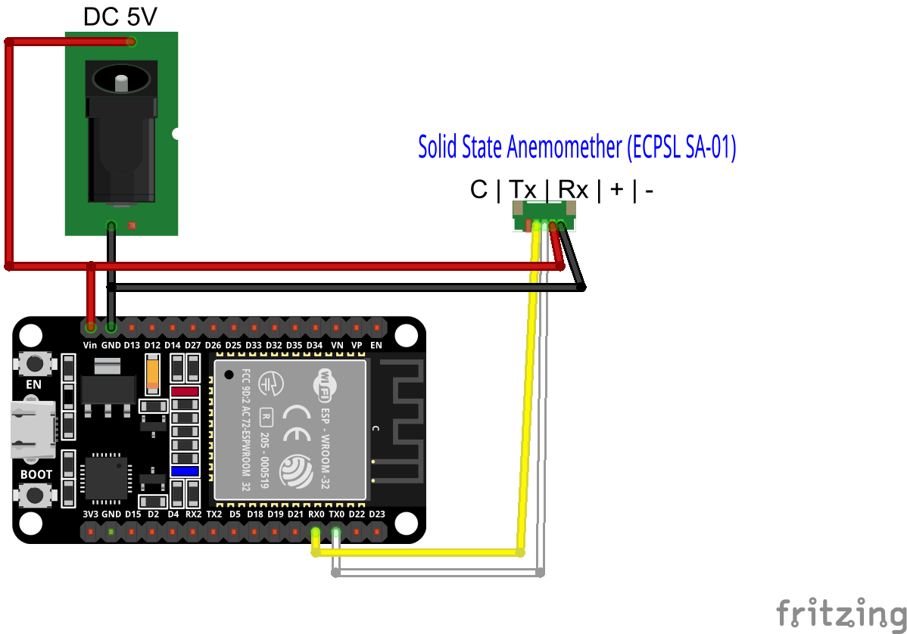
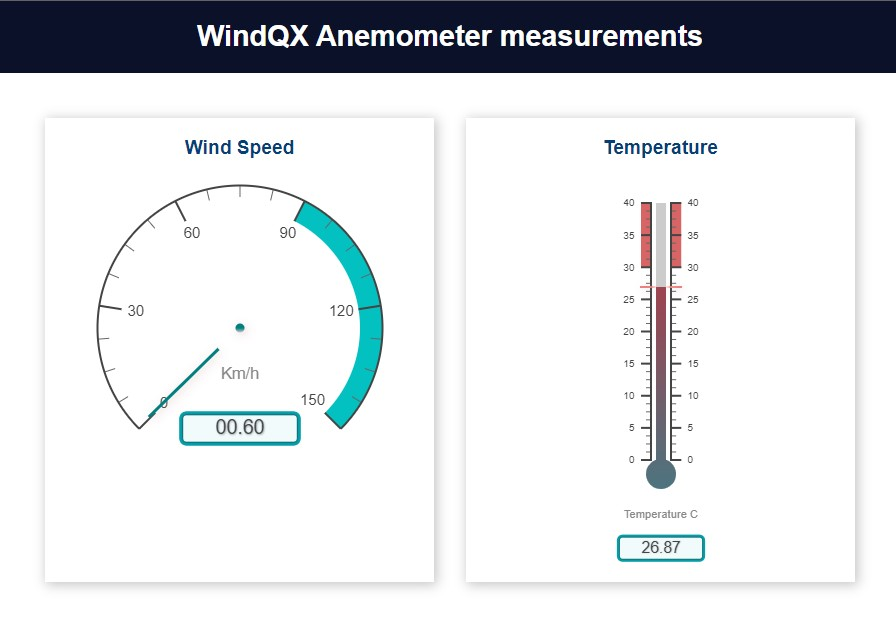
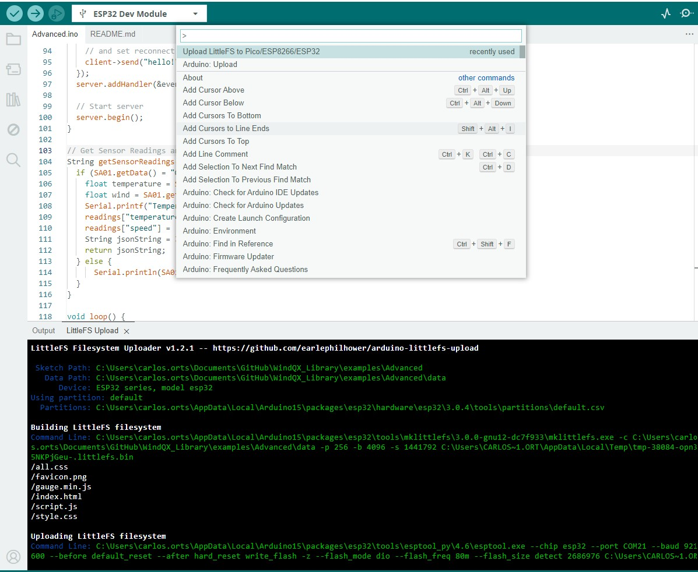

# WindQX Library advanced example

## Update user UI files
Then, upload the code to your ESP32 board. Make sure you have the right board and COM port selected. Also, make sure you’ve added your network credentials.

Arduino IDE 2 Upload Button
After uploading the code, you need to upload the files to the filesystem.

Press [Ctrl] + [Shift] + [P] on Windows or [⌘] + [Shift] + [P] on MacOS to open the command palette. Search for the Upload LittleFS to Pico/ESP8266/ESP32 command and click on it.

If you don’t have this option is because you didn’t install the filesystem uploader plugin. [Check this tutorial](https://randomnerdtutorials.com/arduino-ide-2-install-esp32-littlefs/).

## References
https://randomnerdtutorials.com/esp32-web-server-gauges/
https://randomnerdtutorials.com/arduino-ide-2-install-esp32-littlefs/#introduction
https://randomnerdtutorials.com/esp32-wi-fi-manager-asyncwebserver/
